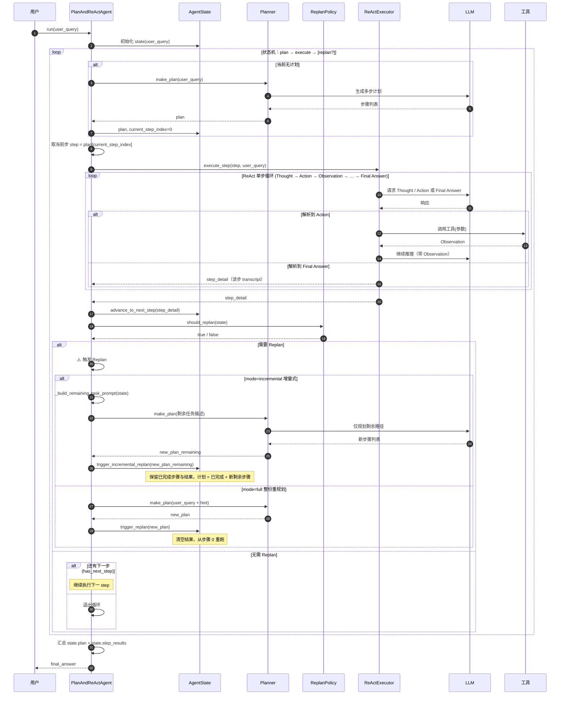

# Plan-and-Execute + ReAct 混合 Agent 示例（Python）

这是一个可直接运行的示例工程，展示了如何用 Python 实现 **Plan-and-Execute + ReAct** 混合推理 Agent。
https://cdn.nlark.com/yuque/0/2026/png/297975/1773559460523-90995604-0d1c-4373-bce6-9b3aa6ee125a.png
## 1. 环境要求

- Python 版本：3.9+（推荐 3.10+）
- 操作系统：macOS / Linux / Windows 均可

## 2. 安装依赖

```bash
cd plan-and-execute
python -m venv .venv
source .venv/bin/activate  # Windows 使用 .venv\Scripts\activate
pip install -r requirements.txt
```

Planner 与 ReAct 执行器默认使用 **通义千问（Qwen）**；也可切换为 **DeepSeek**。

- **Qwen（默认）**：在 `.env` 中配置 `DASHSCOPE_API_KEY=sk-xxx`（阿里云百炼控制台获取）。
- **DeepSeek**：配置 `DEEPSEEK_API_KEY=sk-xxx`，并设置 `LLM_PROVIDER=deepseek` 或在代码中传入 `provider="deepseek"`、`model="deepseek-chat"`。

未配置或调用失败时，会自动回退到内置规则计划，无需 Key 也能运行。

## 3. 目录结构

```text
plan-and-execute/
  ├── requirements.txt
  ├── README.md
  ├── main.py
  └── agent/
      ├── __init__.py
      ├── tools.py
      ├── planner.py
      ├── react_executor.py
      └── plan_and_react_agent.py
```

## 4. 运行流程时序图

下图描述一次完整请求中，各组件之间的调用顺序与 Replan 分支（基于 LangGraph 风格的 Plan → Execute → 条件 Replan 状态机）。



- **Plan 节点**：无计划时由 Planner 调用 LLM 生成多步计划并写入 `AgentState`。
- **Execute 节点**：对当前步骤调用 ReActExecutor，内部多轮 Thought → Action（工具）→ Observation，直至 Final Answer，返回该步 transcript。
- **Replan 条件边**：每步执行后由 ReplanPolicy 判断是否失败；若触发则按 `mode` 做增量式（保留已完成 + 重规划剩余）或整份重规划，再继续状态机循环。

## 5. 运行示例

在项目根目录执行：

```bash
python main.py
```

然后按照提示输入你的自然语言问题，例如：

```text
请输入你的问题（输入 q 退出）：请对比一下使用向量数据库和直接全文检索在小型项目中的优缺点。
```

程序会输出：

- 自动生成的高层 Plan
- 针对每个 Plan 步骤的 ReAct 推理过程（由 LLM 输出 Thought / Action，执行工具得到 Observation，直至 Final Answer）
- 一个简单的最终总结

## 6. 模型配置（Qwen / DeepSeek）

支持两种提供商，通过 **provider** 或环境变量 **LLM_PROVIDER** 切换：

| 提供商 | 环境变量 | 默认模型 |
|--------|----------|----------|
| **Qwen**（默认） | `DASHSCOPE_API_KEY`、`DASHSCOPE_BASE_URL` | `qwen-plus` |
| **DeepSeek** | `DEEPSEEK_API_KEY`、`DEEPSEEK_BASE_URL` | 需显式传 `model="deepseek-chat"` |

- Planner / ReActExecutor 构造参数：`api_key`、`base_url`、`provider`（`"qwen"` | `"deepseek"`）、`model`、`use_llm`。
- 使用 DeepSeek：设置 `LLM_PROVIDER=deepseek` 或在代码中 `Planner(provider="deepseek", model="deepseek-chat")`，ReActExecutor 同理。
- `use_llm=False`：禁用 LLM，仅用规则回退（Planner）或简单说明（ReAct）。

**ReAct 执行器**与 Planner 共用同一套 provider / api_key / base_url / model 配置。

## 7. Replan 与增量式重规划（Incremental Replanning）

当某子任务执行失败时，通过 **ReplanPolicy** 决定是否重规划；推荐使用**增量式**重规划，保留已完成成果，仅重塑剩余路径。

- **ReplanPolicy(mode="incremental")**（默认）：保留已成功步骤及结果，仅对「剩余任务」重新生成计划并继续执行；Planner 会收到「原始任务 + 已完成步骤摘要 + 失败步信息」，只输出从失败步起的新步骤。
- **ReplanPolicy(mode="full")**：整份计划重规划，从步骤 0 重新执行全部（不保留此前结果）。
- 使用方式：`PlanAndReActAgent(..., replan_policy=ReplanPolicy(mode="incremental"))`；`main.py` 中已默认启用增量式 Replan。

## 8. 测试

### 单元测试（Mock，快速）

```bash
python -m pytest tests/test_plan_react_agent.py -v
```

### 真实 Case 集成测试（无 Mock，需 API Key）

使用真实 Planner、Executor 与工具，不 Mock。需配置 `DEEPSEEK_API_KEY` 或 `DASHSCOPE_API_KEY`，运行较慢。

```bash
python -m pytest tests/test_plan_react_agent_real.py -v
# 排除慢速集成测试只跑单元测试
python -m pytest tests/ -v -m "not slow"

python -m unittest tests.test_plan_react_agent_real.TestRealIncrementalReplan.test_second_step_fail_then_incremental_replan -v
```

| 用例 | 说明 |
|------|------|
| **不需要 Replan** | 查询：「帮我规划5天深圳到厦门的行程」。全程顺利执行，断言输出含用户问题、高层计划、执行过程、最终总结及深圳/厦门。 |
| **需要全量 Replan** | 查询：先调用「测试失败」工具（会报错）再用计算器算 10+20。第一步失败触发 full replan，整份重跑后断言含重规划与 30。 |
| **需要增量 Replan** | 查询：先查深圳天气 → 调用「测试失败」→ 算 1+1。第二步失败触发 incremental replan，保留第一步结果，断言含重规划、深圳、2。 |

## 9. 扩展方向

- 在 `tools.py` 中增加真实业务工具，例如：
  - 调用搜索 API、向量数据库；
  - 查询内部服务 / 数据库；
  - 调用计算、翻译等微服务。

## 10. 许可证

你可以自由修改、商用或集成该代码，无需署名。

